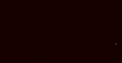

# projet_patatap_1920

This repo holds the code for a creative coding class with [p5js](https://p5js.org/) taught [@lecolededesign](https://www.lecolededesign.com/) : students were asked to create a webpage holding 26 sounds and 26 animation - on for each letter of the alphabet. Using as an inspiration : [patatap](https://www.patatap.com/).

Code is available [here](https://github.com/AtelierNum/projet_patatap_1920)

# Agathe Cornette

[Cliquez ici pour jouer](https://ateliernum.github.io/projet_patatap_1920/Agathe_Cornette/code/index.html)

Le thème de mon Patatap s’inspire du Jazz, notamment d’un jazzman en particulier : Miles Davis. 
J’ai souhaité travailler avec des couleurs chaudes et pastels, rappelant l’ambiance calme et chaude d’un concert de jazz. 
J’ai tenté de construire mon patatap de manière à ce que l’utilisateur puisse découvrir la morphologie d’une musique (Ascenseur pour l’échafaud) rythmée par la trompette, instrument de prédilection de Miles Davis. 
Cela me tenait à coeur de m’appuyer sur cette musique en particulier, car elle est selon moi un moyen pertinent de faire découvrir le jazz. 

# Antoine Dessaint

[Cliquez ici pour jouer](https://ateliernum.github.io/projet_patatap_1920/Antoine_Dessaint/code/index.html)

Dans le cadre de mon patatap, je me suis inspiré de l'univers synthwave, vaporwave, retro etc...
J'ai placé un fond en cyan avec des formes magenta qui animent mon patatap qui donnent une ambiance extrêmement artificiels
Ainsi les sons que j'ai placé, sont des sons de synthétiseurs et de basses accompagné de beats et de kicks.

# Arthur Jean

[Cliquez ici pour jouer](https://ateliernum.github.io/projet_patatap_1920/Arthur_Jean/code/index.html)

Pour mon Patatap j'ai choisi le thème du rap. Allant du old school à la trap en passant par le soundcloud rap.
J'ai choisi ce sujet car c'est un style de musique que j'apprécie particulièrement, et car de base le rap a été 
inventé par les minoritées pour mettre en lumière les injustices et la discrimination omniprésente. C'est pourquoi 
mon Patatap est en noir et blanc.(lumière/Contraste/mise en évidence). Avec des formes assez simple comme des carrées,
ronds. J'ai pris des sons utilisés dans les anciens rap et les nouveaux, avec des bruitages souvent présent dans les 
musique de rap comme le bruit d'une cassette vhs, d'un pistolet...

# Ayoub Zarafa

[Cliquez ici pour jouer](https://ateliernum.github.io/projet_patatap_1920/Ayoub_Zarafa/code/index.html)

Le théme de mon Patatp tourne autour de la culture japonaise et de la culture POP. J'ai donc réalisé 26 animations  qui sont lié au manga, les instruments traditionels et le les tambours japonais . Lorsque l’on touche alors les 26 touches en même temps on y ressort un boucan monstre ponctué divers,  et des références à la japnimation.

# Bastien Denecheau

[Cliquez ici pour jouer](https://ateliernum.github.io/projet_patatap_1920/Bastien_Denecheau/code/index.html)

L'univers de mon patatape appelé "épectase" (Soit le fait de mourir pendant l'orgasme) est une combinaison de sons 
provoquant le malaise. Pour contraster avec les sons bizzares, j'ai ajouté quelques sons de piano et de guitare ce 
qui renforce l'aspect embarrassant. Aussi je suis resté dans des tonalités de couleurs bleutées et/ou rosâtres qui 
expriment bien le froid et l'univers dans lequel on est projeté.

# Camille Jouaber

[Cliquez ici pour jouer](https://ateliernum.github.io/projet_patatap_1920/Camille_Jouaber/code/index.html)

Mon patatap s'inspire du monde africain, étant moi-même originaire du nord de ce continent. Il reprend les sons des instruments utilisés là bas, comme l'agogo bell ou le bongo. J'ai utilisé des couleurs chaudes, en accord avec les températures chaudes de là-bas.

# Chloé Bellanger Abadie

[Cliquez ici pour jouer](https://ateliernum.github.io/projet_patatap_1920/Chloe_Bellanger-Abadie/code/index.html)

J’ai choisi de baser mon patatap sur des instru de rap car c’est un univers que j’aime bien. J’ai donc essayé de créer des sons en accord avec les musiques de rap que j’écoute et à travers les couleurs des animations j’ai voulu traduire la sensation agréable que je ressens en les écoutant.

# Clément Chevalier

[Cliquez ici pour jouer](https://ateliernum.github.io/projet_patatap_1920/Clement_Chevalier/code/index.html)

Mon Patatap s’inspire de l’univers de la mer, avec les vagues, les climats (pluie, vent..) les animaux marins (crabes, baleines…) et aériens (mouettes) qui le compose. Les animations, principalement dans les tons bleus, immerges ainsi le spectateur dans un milieu aquatique et lui permet d’être transporté. 

J’ai choisis la mer, puisque c’est un milieu fascinant où toutes vies et mouvements ne sont qu’éphémères.

# Clément Heliot

[Cliquez ici pour jouer](https://ateliernum.github.io/projet_patatap_1920/Clement_Heliot/code/index.html)

Entre musique et désordre, entre couleur et incolore, découvrez un univers décalé.
Les inspirations viennent de plusieurs univers meme si les couleurs sont plus en accord.
Le tout réuni forme un ensemble plutôt sympa a regarder, bon visionnage.

# Coralie Picard

[Cliquez ici pour jouer](https://ateliernum.github.io/projet_patatap_1920/Coralie_Picard/code/index.html)

Pour mon patatap je me suis inspiré de l'univers du japon en tendant vers leurs jardins zen.
J'ai enregistrer le son d'un kalimba (instrument africain beaucoup utilisé en Asie) afin de retrouver cet aspect calme est contemplatif.

# Dohyeon Kim

[Cliquez ici pour jouer](https://ateliernum.github.io/projet_patatap_1920/Dohyeon_Kim/code/index.html)

# Eloi Dardenne

[Cliquez ici pour jouer](https://ateliernum.github.io/projet_patatap_1920/Eloi_Dardenne/code/index.html)

Pour ce projet sur le patatap j'ai décidé de travailler sur un univers électronique en reprenant plusieurs kicks, sons psychédéliques ou acid.
L'univers graphique est inspiré de ce que l'on peut trouver dans les maping à thème techno, avec des couleurs rouges, blanche et un fond noir.
Les animations sont réalisées uniquement grâce à mes connaissances, je ne suis pas aller copier-coller du code sur internet. 
Mon principal problème a été d'avoir des animations complexe et fluide à la foi. 

# Emma Bluteau

[Cliquez ici pour jouer](https://ateliernum.github.io/projet_patatap_1920/Emma_Bluteau/code/index.html)

Pour mon patatap j'ai voulu créer un univers à la fois coloré mais tout de même
assez sobre, comprnant seulement une seul couleur sortant du camaieu de bleu, le rose fushia.
L'univers est assez léger, aérien et lumineux avec la neige et les formes rondes se répétant, 
apportant harmonie et délicatesse. Les sons se fondant totalement dans la musicalité dégagée
par les couleurs. 

# Emma Zafimahova

[Cliquez ici pour jouer](https://ateliernum.github.io/projet_patatap_1920/Emma_Zafimahova/code/index.html)

La création de ce Patatap se tourne vers un univers graphique dynamique, chaud.
L’univers sonore, lui, reproduit un concert, avec différentes possibilités de morceaux et un public acclamant l’artiste. L’artiste, c’est celui qui joue, c’est toi. 

# Enora Delavigne

[Cliquez ici pour jouer](https://ateliernum.github.io/projet_patatap_1920/Enora_Delavigne/code/index.html)

Je voulais, via mon projet, donner une ambiance d'une balade en forêt. J'ai donc trouv" des sons comme de l'eau qui coule, des bruits de pas, d'animaux etc. mais aussi des bruits humains: bruit de clochettes, appareil photo J'ai choisi des couleurs claires et pastelles pour coller à l'univers calme.
J'ai aussi choisi de faire des animations et des formes assez rondes, avec beaucoup de cercles pour coller à l'univers calme.

# Enora Jaffre

[Cliquez ici pour jouer](https://ateliernum.github.io/projet_patatap_1920/Enora_Jaffre/code/index.html)

Le thème de ce Patatap est une référence au film 
d'animation japonaise de Satoshi Kon: Paprika. Les 
couleurs, les incohérences cartoonesques psychédéliques 
telles que la scène de parade, où l'imagination prend le 
pas sur la réalite ainsi que la scène du cirque en ont 
été l'inspiration.

# Eric Le Carer

[Cliquez ici pour jouer](https://ateliernum.github.io/projet_patatap_1920/Eric_Le_Carer/code/index.html)

Les sons de mon Patatape ont été enregistré dans la salle fond vers de l'école afin de trouver des sons originaux provenant de tous les objets de la salle.
Les animations majoritairement de couleur verte permettent de situer d'où viennent les sons.

# Eva Massin

[Cliquez ici pour jouer](https://ateliernum.github.io/projet_patatap_1920/Eva_Massin/code/index.html)

Mon patatap porte sur une vidéo de FlashBoy.mp4. Cet artiste est un danseur, éditeur et beatmaker, qui s’est principalement fait connaître par celle-ci : https://www.youtube.com/watch?v=-4R0WCWOzv0. Je me suis donc inspiré de l’univers de sa vidéo qui est sur le thème de Naruto, en incorporant des formes en lien avec ce thème (sharingan…), et en reprenant ses 3 principales couleurs (rose, bleu, rouge) en plus du blanc. Tous les sons proviennent de sa vidéo. 

# Guillaume Chuquet

[Cliquez ici pour jouer](https://ateliernum.github.io/projet_patatap_1920/Guillaume_Chuquet/code/index.html)

# Isaac Lefebvre

[Cliquez ici pour jouer](https://ateliernum.github.io/projet_patatap_1920/Isaac_Lefebvre/code/index.html)

Mon univers repose sur le jeux vidéo Minecraft, j'ai repris un son sur la plupart des monstres, musiques,... 

# Jade Gagnepain

[Cliquez ici pour jouer](https://ateliernum.github.io/projet_patatap_1920/Jade_Gagnepain/code/index.html)

À travers ces différentes animations, j’ai voulu réaliser un univers composé de couleurs et de formes géométriques aux styles rétro, pop et mouvementé. Pour compléter cet univers j’ai choisi des animations à la sonorité à la fois moderne et vintage qui se répètent de différentes manières. Mon but était alors de créer un ensemble joyeux, coloré et dynamique, mais surtout de créer un ensemble harmonieux et cohérent.

# Joseph Han

[Cliquez ici pour jouer](https://ateliernum.github.io/projet_patatap_1920/Joseph_Han/code/index.html)

# Kenza Loussouarn

[Cliquez ici pour jouer](https://ateliernum.github.io/projet_patatap_1920/Kenza_Loussouarn/code/index.html)

Je voulais que l’univers de mon Patatap inspire une ambiance relaxante à ceux qui jouent avec.
J’ai en effet ajouté des bruits de mer, d’oiseaux, de pas, du vent… Dans le but de nous plonger dans une atmosphère de balade.
J’ai choisi toutes mes animations en couleur pastel pour rappeler le côté doux et relaxant de mon sujet et qu’on soit plongé dans le thème.

# Larsen Lestrad

[Cliquez ici pour jouer](https://ateliernum.github.io/projet_patatap_1920/Larsen_Lestrad/code/index.html)

Mon Patatap est basé sur des sons électroniques, j’ai cherché à retranscrire une ambiance de science-fiction. Cela dit, le visuel n’est pas basé sur une esthétique particulièrement futuriste mais sur une charte graphique inspiré des affiches du film Kill Bill. J’ai cherché avant tout à expérimenter un maximum de chose, tout en gardant une cohérence. 

# Lison Guignard

[Cliquez ici pour jouer](https://ateliernum.github.io/projet_patatap_1920/Lison_Guignard/code/index.html)

L’univers de mon patatap s’inspire de la musique principalement l’électro. L’utilisation de sons très court permettant de former un rythmes, les couleurs criardes contrastant avec le fond, ainsi que les différentes formes géométriques rappelle  les animations ou visuels associés à cet univers.
J’aime la multitude créer par les sons ou formes tous différents, poussant l’utilisateur à une découverte aléatoire de mon patatap.

# Mael Jallais

[Cliquez ici pour jouer](https://ateliernum.github.io/projet_patatap_1920/Mael_Jallais/code/index.html)

Le sujet de mon Patatap est autour de l’abstraction grâce a diverses formes géométriques tout en gardant une cohérence au niveau des couleurs. 
Pour les effets sonores je me suis en grande partie inspiré des sons de notifications et interactifs.

# Marie Sambron

[Cliquez ici pour jouer](https://ateliernum.github.io/projet_patatap_1920/Marie_Sambron/code/index.html)

Mon Patatap s’inspire de l’ambiance et de l’univers japonais. 
Il comporte des sons que l’on peut entendre au sein de la nature et de certaines villes du Japon. 
Les couleurs choisies pour mon projet sont les plus symboliques du pays ; on peut les retrouver sur le drapeau du Japon, les tenues traditionnelles,
les estampes et les films d’animation par exemples (rouge, blanc, orange, rose pâle et bleu foncé).

# Martin Fourny

[Cliquez ici pour jouer](https://ateliernum.github.io/projet_patatap_1920/Martin_Fourny/code/index.html)

L'univers de mon patatap est s'intègre dans le thème des appareils électroniques. Tout type de son électronique 
autant d'instruments virtuels (synthwave ,voix de vocaloid,sons de télepone, robots ect) que de sons mécaniques et de sons de notifications. J'ai fait des recherches sur quels
sons se mélangent le plus entre eux entre des kick des hats et des bass avec que des durées d'audios courts (sauf deux trois long) afin
de créer un mélange cohérent.  

# Mathis Girard

[Cliquez ici pour jouer](https://ateliernum.github.io/projet_patatap_1920/Mathis_Girard/code/index.html)

Bon but pour se Patatap aura était de créer un univers psychédélique, a base de forme réagissant au son, 
accompagné de couleur flashy. Les couleurs redondantes sont le vert et le violet. Sur un fond sombre 
pour faire ressortir celle-ci sur des sons électroniques.

# Matteo Cremonesi

[Cliquez ici pour jouer](https://ateliernum.github.io/projet_patatap_1920/Matteo_Cremonesi/code/index.html)

L’idée était de mélanger des lignes très fine a des formes souples le tout dans une ambiance chaude sur des teintes de bordeaux foncé. Pour balancer tous les nuance sombre j’ai ajouté du marron clair dériver jusqu’au jaune. Le mélange des son et des formes crée une atmosphère joyeuse et festive. L’objectif était de faire de ce Patatape une expérience simple et dynamique.

# Matthias Baranger

[Cliquez ici pour jouer](https://ateliernum.github.io/projet_patatap_1920/Matthias_Baranger/code/index.html)

Pour le projet patatap, mon objectif numéro 1 était que l'ensemble du code fonctionnait et donc je n'ai pas de style défini.
Mais mon style serait plus un jeu, l'objectif serait de trouver des chansons et de les rassembler. 
Le style finale est donc quelque chose de coloré dans une ambiance décalé.

# Maxence Renard

[Cliquez ici pour jouer](https://ateliernum.github.io/projet_patatap_1920/Maxence_Renard/code/index.html)

J'ai choisis le thème de la peur, et de l'horreur pour mon Patatap. J'ai choisis des son en relation avec cet univers, des sons qui peuvent provoquer l'angoisse ou la peur, comme des cris, ou bien des sons inspirant les films d'horreur (Tronçonneuse, monstre, rire effrayant...). Quand à la partie graphique j'ai choisi de travailler majoritairement avec du noir, du blanc (evoquant la nuit), et des touches de rouges pour le coté "sang" ou "enfer" par exemple.

# Morgane Loas

[Cliquez ici pour jouer](https://ateliernum.github.io/projet_patatap_1920/Morgane_Loas/code/index.html)

L’objectif de mon patata est de mettre en commun le chant et les voix afin de créer une petite chorale .les sons utiliser sont tous très simple avec des trompette ou encore guitare , seul les chants vienne relever le tons .et enfin les formes et les couleurs sont pastel et créent une certaine harmonie comme dans les chorale ou les sons et les voix son accordée .

# Paco Caillaud

[Cliquez ici pour jouer](https://ateliernum.github.io/projet_patatap_1920/Paco_Caillaud/code/index.html)

J’ai commencé mon patatap en choisissant mes sons. Je voulais des sons électroniques voir mécanique. Je voulais une ambiance assez futuriste et punk. Avoir une ambiance sonore pesante mais intrigante.
L’esthétique graphique est très digitale.  Pour garder une cohérence tout le long du patatap et renforcer l’ambiance sonore j’ai uniquement pris 4 couleurs. Noir, blanc et gris et pour contraster et donner un côté “vivant” un rouge sang. 

# Paul Bluteau

[Cliquez ici pour jouer](https://ateliernum.github.io/projet_patatap_1920/Paul_Bluteau/code/index.html)

Lors de ce projet, j’ai cherché à m’initier au code très rapidement j’ai été attiré par la 3D, ainsi j’ai produit un travail exclusivement en WEBGL.
Après avoir construit des sonorités de toutes pièces (à écouter avec un casque pour bénéficier de la stéréo) j’ai cherché à les illustrer avec des visuels dynamique et coloré dans un univers électrique sombre. 

# Paul Maurin

[Cliquez ici pour jouer](https://ateliernum.github.io/projet_patatap_1920/Paul_Maurin/code/index.html)

Cette univers et un mélange de Cartoon(la version simplifier de la vie) dans les sons qui permet une compréhension de tous ainsi que de psychédélisme qui au contraire et très subjectif et permet une représentation de la synesthésie proche de travaux d’artiste qui expérimentaient cela.
Les couleurs sont inspiré du film Enter the void, de Gaspard Noé.

# Salome Allali

[Cliquez ici pour jouer](https://ateliernum.github.io/projet_patatap_1920/Salome_Allali/code/index.html)

I created my patatap on the theme of electro music with short and repetitive sounds. My Patatap can be similar to a Launchpad because you can create music and rhythm by playing with letters.
For the colors, I wanted to stay in an electro universe, a world of nightlife and festivals. My colors are blue, green and dark green on a night blue background, they highlight my animations that flash and rhythm my patatap

# Stéphanie Dorval

[Cliquez ici pour jouer](https://ateliernum.github.io/projet_patatap_1920/Stephanie_Dorval/code/index.html)

Pour mon PATATAP, j’ai choisi d’utiliser un nombre limité de couleurs pour créer un univers graphique et des animations contrastées. Pour les animations, j’ai voulu jouer avec des formes géométriques simples en les faisant interagir de façons différentes : rotation, apparition, répétitions en rythme avec la musique… Quant aux sons, j’ai créé des sons simples et rythmés qui permettent de mettre en valeur les différentes animations et d'apporter davantage de rythme.

# Tom Jagueneau

[Cliquez ici pour jouer](https://ateliernum.github.io/projet_patatap_1920/Tom_Jagueneau/code/index.html)

Après quelques essais avec des sons et des ambiances electros, je me suis orienté sur un thème à mon sens plus original.
Mon Patatap se rattache à l'univers médieval, s'inspirant de personnages historique et d'ambiances typiques de cette époque.

Les six touches de la dernière ligne correspondent à six ambiances, celles-ci ont des sons avec des durées plus longues et servent de fond sonore (elles n'ont pas pour objectif premier de s'associer).
Le reste des touches représentent des effets sonores avec une durée de son plus court. L'objectif est que celles-ci au nombre de vingts s'articulent avec les six ambiances.

